# Data Science Portfolio
Technical Skills : Python , R , SQL ,Tableau 
## [Regression Diagnostic with R](https://github.com/sana1410/Data-Science-Portfolio/tree/main/Linear%20Regression)
* In this project we are going to fit, interpret and evaluate linear regression model on “AmesHousing” dataset.
* Performed Exploratory Data analysis and descriptive statistics to describe data.
* Performed Data cleaning by imputing missing values with zero.
* Created correlation matrix and plots to find highly correlated variables.
* Performed Linear regression and model interpretation using diagnostic plots.
* Implemented diagnostic techniques to identify and correct issues with the model like multicollinearity and presence of outliers.

## [GLM and Logistic Regression with R](https://github.com/sana1410/Data-Science-Portfolio/tree/main/GLM%20and%20Logistic%20Regression)
The objective of this project is use "college dataset" from ISLR library to build a logistic regression model to predict whether a university is private or public.
* Performed Exploratory Data analysis and Descriptive analysis on dataset.
* Data preparation for modelling that included spitting the dataset into train and test data.
* Fit logistic regression model using glm() function in R.
* Created confusion matrix for both train and test datasets.
* Calculated and interpreted model metrics like Accuracy,Recall , Specificity and Precision for both Train and test datasets.
* Plot and interpret ROC curve and AUC for both test and train datasets .
### Exploratory Data Analysis
### Boxplots
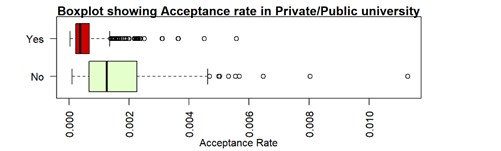
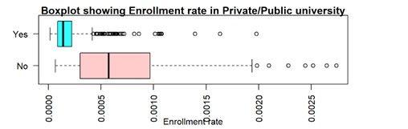
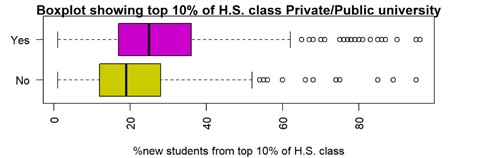
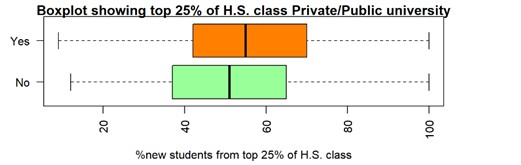
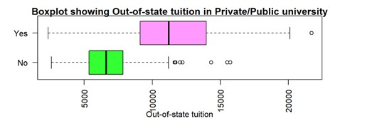
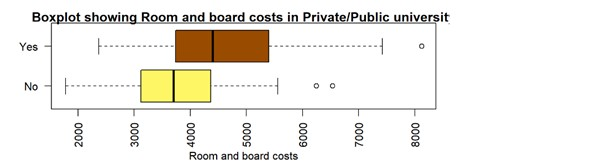
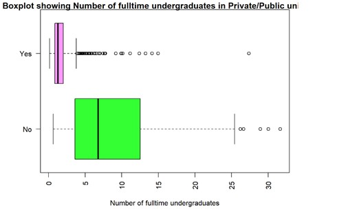
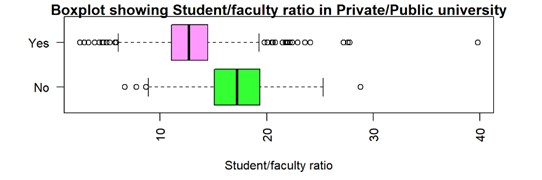
### Density Plots
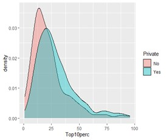
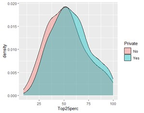
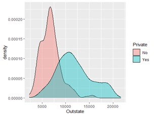
### Scatterplots
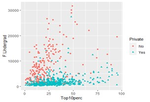
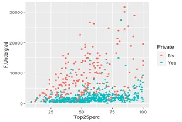
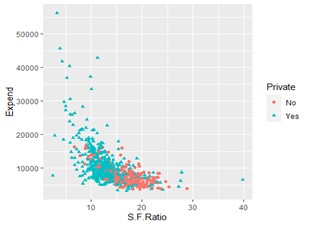
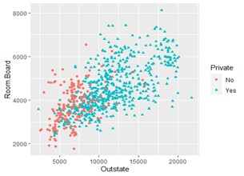
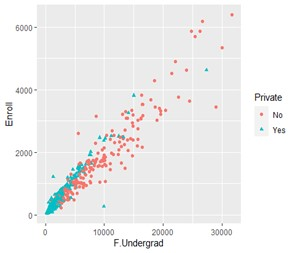
## Correlation Matrix
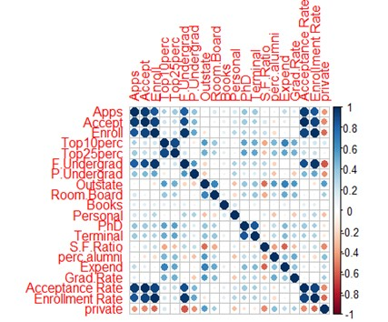
## Model on Train Data
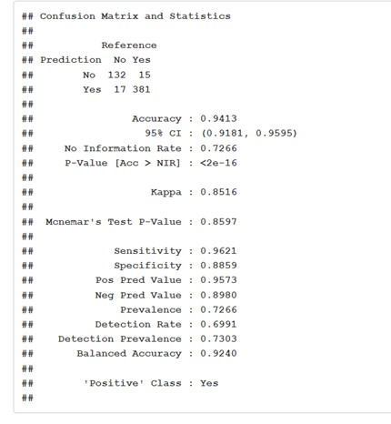
## ROC Curve
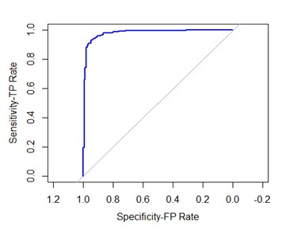
## Model on Test data
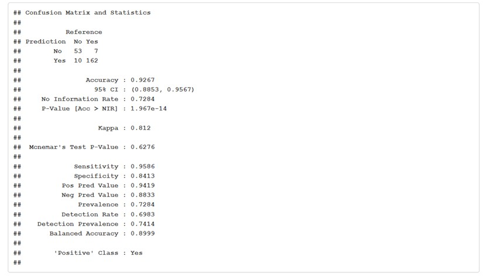
## ROC curve
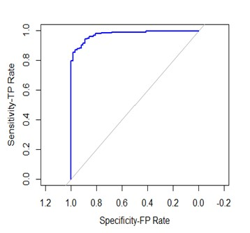
